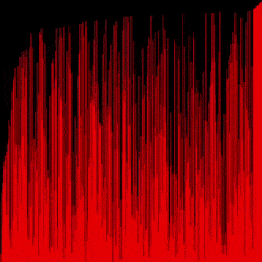

# VisualSorting
This is a sorting algorithm visualizer made in pygame



## Usage
```
$ git clone https://github.com/Tch1b0/VisualSorting

$ pip install pygame

$ python VisualSorting [optional algorithm] [...options]
```
The defualt algorithm is the `bubble sort`. 
<br>You can see **all available algorithms** using the `python VisualSorting --help` command.

## Algorithms
I am working on adding other algorithms
- [x] Bubble sort
- [x] Bogo sort
- [x] Gnome sort
- [ ] Quick sort
- [ ] Merge sort